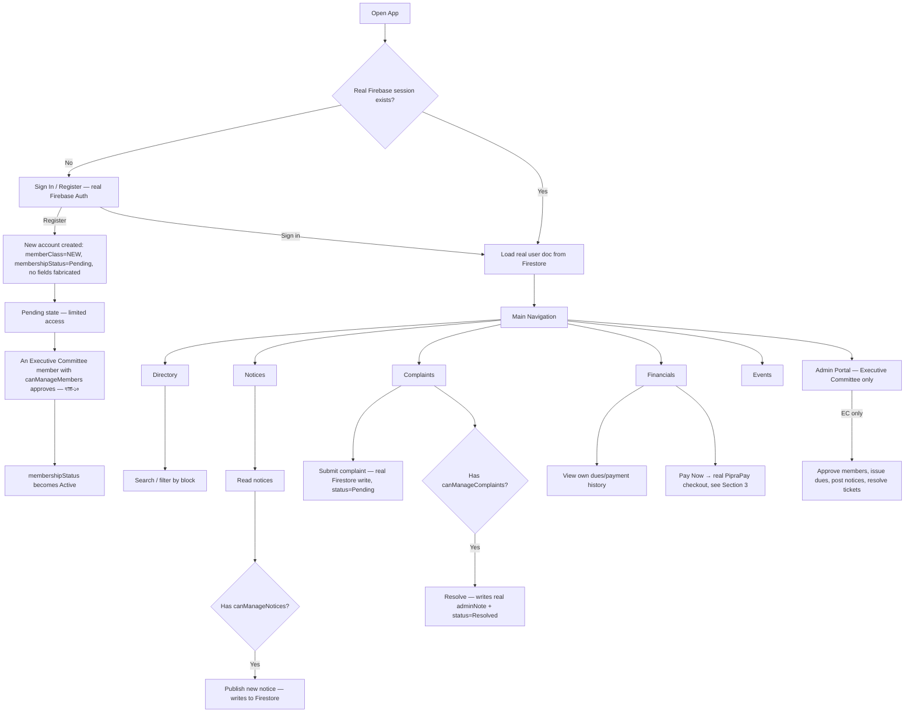
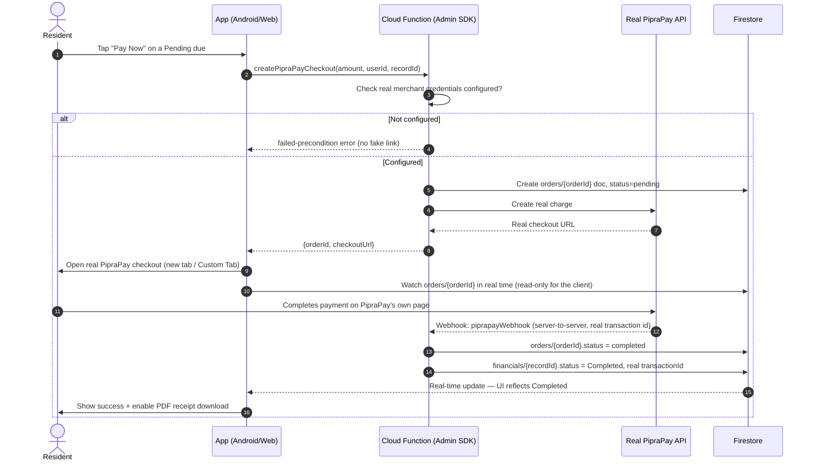

# Kunjachaya Club — Workflow & Architecture

## 1. Role & Permission Hierarchy (from the real constitution)

```
                    ┌───────────────────────────┐
                    │  President / Gen. Secretary │  Broadest authority (ধারা-১৭)
                    └──────────────┬──────────────┘
                                   │
                    ┌──────────────▼──────────────┐
                    │  Executive Committee (13)    │  Vice Pres., Treasurer, Organizing Sec.,
                    │  remaining posts (ধারা-১৪)   │  Social Welfare, Lit. & Culture, Publicity,
                    │                               │  Sports, Women's Affairs, 3× Exec. Member
                    └──────────────┬──────────────┘
                                   │
        ┌──────────────┬──────────┼──────────┬──────────────┐
        ▼              ▼          ▼          ▼              ▼
    Founding        General    Lifetime    Donor        Advisory
    Member          Member     Member      Member       Member
   (ধারা-৬)        (ধারা-৬)   (ধারা-৬)    (ধারা-৬)     (ধারা-৬)
        │
        ▼
    New Member (Pending) — every account starts here (ধারা-১০)
```

### Permission Matrix

| Capability | President / Gen. Sec. | EC member w/ matching flag | Founding/General | Lifetime/Donor | Advisory | New (Pending) |
|---|:---:|:---:|:---:|:---:|:---:|:---:|
| Approve new members (ধারা-১০) | ✅ | ✅ if `canManageMembers` | ❌ | ❌ | ❌ | ❌ |
| Publish notices | ✅ | ✅ if `canManageNotices` | ❌ | ❌ | ❌ | ❌ |
| Resolve complaints | ✅ | ✅ if `canManageComplaints` | ❌ | ❌ | ❌ | ❌ |
| Issue/manage dues | ✅ | ✅ if `canManageFinancials` | ❌ | ❌ | ❌ | ❌ |
| Delete records | ✅ | only President/Gen.Sec. | ❌ | ❌ | ❌ | ❌ |
| Vote at general meetings (ধারা-৯খ) | ✅ | ✅ | ✅ | ❌ | ❌ | ❌ |
| View directory, pay own dues, submit complaints | ✅ | ✅ | ✅ | ✅ | ✅ | ⚠️ limited until approved |

This is enforced in **two places that must agree**: the app UI (`UserEntity.kt` on Android, `roles.js` on web) for a good experience, and `firestore.rules` for real security — the UI check is a convenience, the rules are the actual boundary.

---

## 2. End-to-End User Flow



---

## 3. Real Payment Flow (PipraPay)

This is the flow that replaced the original fake payment simulation — no step here can be faked by the client.



Key property: **the client only ever reads** `orders/{orderId}` and `financials/{recordId}` — it never writes `status: "Completed"` to either. `firestore.rules` blocks that write for anyone; only the Cloud Function's Admin SDK (which bypasses rules) can do it, and only after a real webhook fires.

---

## 4. Data Model (shared by both platforms)

| Collection | Key fields | Written by |
|---|---|---|
| `users` | `id` (= Firebase Auth UID), `memberClass`, `committeePost`, `membershipStatus`, `canManage*` flags | Self (limited fields) on register; EC member (all fields) on approval/role change |
| `financials` | `userId`, `type`, `status`, `amount`, `transactionId`, `docId` | EC member (dues issuance), resident (own donation, Pending only), Cloud Function (completion only) |
| `announcements` | `titleEn/Bn`, `categoryEn`, `priority` | EC member with `canManageNotices` |
| `complaints` | `userId`, `status`, `adminNoteEn/Bn` | Resident (create, own only), EC member with `canManageComplaints` (resolve) |
| `Events` | `date`, `time`, `locationEn/Bn`, `isReminderSet` | EC member (create), any signed-in user (their own reminder toggle only) |
| `orders` | `orderId`, `status`, `userId` | Cloud Function only — client read-only |
| `ActivityLogs` | `adminId`, `titleEn/Bn`, `timestamp` | EC members only, both read and write |

---

## 5. Core Files Reference

- **`app/src/main/java/com/example/data/model/UserEntity.kt`** — `MemberClass` + `CommitteePost` enums, all permission predicates. Source of truth on Android.
- **`web/src/roles.js`** — exact same logic, JS. Source of truth on web.
- **`firestore.rules`** — the real security boundary; every permission check above is re-implemented here server-side.
- **`functions/src/index.ts`** — `createPipraPayCheckout`, `piprapayWebhook`; the only code path that can complete a payment.
- **`app/src/main/java/com/example/util/FirebaseManager.kt`** / **`web/src/firebase.js`** — real Firebase init, no silent fake-success fallback.
