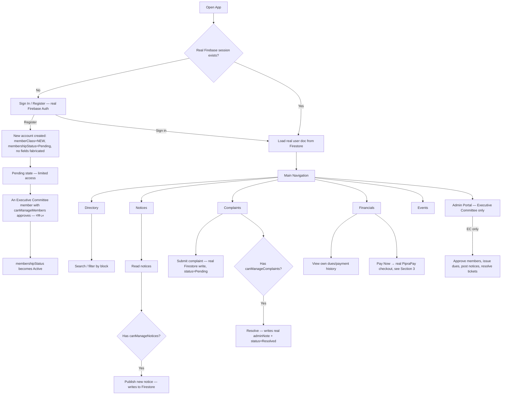
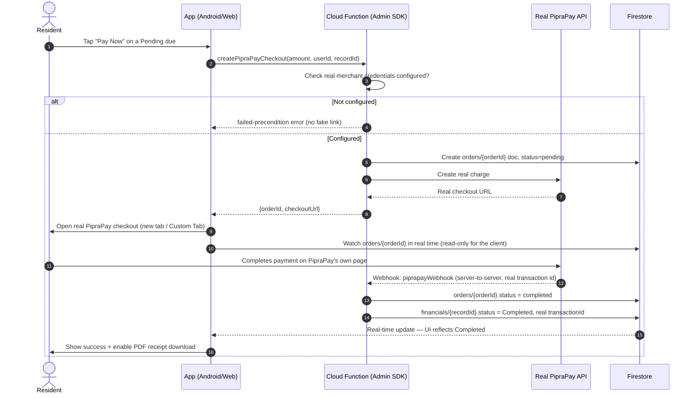

# Kunjachaya Club — Workflow & Architecture

## 1. Role & Permission Hierarchy (from the real constitution)

```
                    ┌───────────────────────────────┐
                    │  President  ⟷  General Secretary │  Co-equal top authority (ধারা-১৭)
                    │  Both independently accountable   │  — see note below on what each
                    │  to the Standing Council           │    actually does day-to-day
                    └──────────────┬─────────────────────┘
                                   │  (may reassign committee posts / permission flags)
                    ┌──────────────▼──────────────┐
                    │  Executive Committee (13)    │  2× Vice Pres., Asst. Gen. Sec., Treasurer,
                    │  remaining posts (ধারা-১৪)   │  Organizing Sec., Social Welfare Sec.,
                    │                               │  Lit. & Culture Sec., Publicity Sec.,
                    │                               │  Sports Sec., Women's Affairs Sec.,
                    │                               │  3× Executive Member
                    └──────────────┬──────────────┘
                                   │
        ┌──────────────┬──────────┼──────────┬──────────────┐
        ▼              ▼          ▼          ▼              ▼
    Founding        General    Lifetime    Donor        Advisory
    Member          Member     Member      Member       Member
   (ধারা-৬)        (ধারা-৬)   (ধারা-৬)    (ধারা-৬)     (ধারা-৬)
        │
        ▼
    New Member (Pending) — every account starts here (ধারা-১০)
```

**Note on President vs. General Secretary:** these are *not* "ceremonial vs. operational" — the text (ধারা-১৭.১, ১৭.৩) gives the President real substantive powers (sets policy, signs contracts, approves expenditure vouchers, supervises officers) and gives the GS the administrative backbone (records, annual reports, membership rolls, correspondence). Both report **independently** to the Standing Council — neither is formally subordinate to the other — which is why the app treats them as equal top-tier authority rather than ranking one above the other.

### Permission Matrix (per committee post)

| Role | Approve members (ধারা-১০) | Post notices | Resolve complaints | Manage dues/financials | Delete records | Vote / hold EC office (ধারা-৯) |
|---|:---:|:---:|:---:|:---:|:---:|:---:|
| **President** | ✅ always | ✅ always | ✅ always | ✅ always | ✅ always | ✅ |
| **General Secretary** | ✅ always | ✅ always | ✅ always | ✅ always | ✅ always | ✅ |
| **Vice President ×2** | if delegated | if delegated | if delegated | if delegated | ❌ never | ✅ |
| **Assistant Gen. Sec.** | if delegated | if delegated | if delegated | if delegated | ❌ never | ✅ |
| **Treasurer** | if delegated | if delegated | if delegated | ✅ suggested default | ❌ never | ✅ |
| **Organizing Sec.** | if delegated | if delegated | if delegated | if delegated | ❌ never | ✅ |
| **Social Welfare Sec.** | if delegated | if delegated | ✅ suggested default | if delegated | ❌ never | ✅ |
| **Lit. & Culture Sec.** | if delegated | if delegated | if delegated | if delegated | ❌ never | ✅ |
| **Publicity Sec.** | if delegated | ✅ suggested default | if delegated | if delegated | ❌ never | ✅ |
| **Sports Sec.** | if delegated | if delegated | if delegated | if delegated | ❌ never | ✅ |
| **Women's Affairs Sec.** | if delegated | if delegated | if delegated | if delegated | ❌ never | ✅ |
| **Executive Member ×3** | if delegated | if delegated | if delegated | if delegated | ❌ never | ✅ |
| **Founding Member** (no post) | ❌ | ❌ | ❌ | ❌ | ❌ | ✅ + Standing Council seat |
| **General Member** | ❌ | ❌ | ❌ | ❌ | ❌ | ✅ |
| **Lifetime / Donor Member** | ❌ | ❌ | ❌ | ❌ | ❌ | ❌ (ধারা-৯খ: attend & speak only) |
| **Advisory Member** | ❌ | ❌ | ❌ | ❌ | ❌ | ❌ (consultative only) |
| **New (Pending)** | ❌ | ❌ | ❌ | ❌ | ❌ | ❌ |

**Why most posts say "if delegated" rather than a hard mapping:** almost every post's duty description in ধারা-১৭ ends the same way — *"কার্যনির্বাহী পরিষদের অর্পিত দায়িত্ব পালন করবেন"* (performs whatever the EC assigns). The constitution only names one hard financial gatekeeper explicitly — the Treasurer (ধারা-১৭.৫: receives all money, keeps the books, liaises with the bank) — so that's the one post where `UserEntity.kt`/`roles.js` pre-check the matching permission flag when assigned. Publicity → notices and Social Welfare → complaints are reasonable pre-checked *suggestions* based on named subject area, not textual mandates — still fully editable in the Role dialog.

**Who can reassign a committee post or edit someone else's permission flags:** only the President or General Secretary (`canAppointOfficers()` / `canModifyUserRole()` in `UserEntity.kt` and `roles.js`). An EC member holding `canManageMembers` can approve and manage *ordinary* members (ধারা-১০গ) but cannot touch another committee member's post or flags — that authority stays with the top two.

**Standing Council's actual scope:** its approval authority (ধারা-১৮, and the amendment narrowing ধারা-১৬ঠ) covers exactly four things — constitution amendments, the annual accounts, the annual budget, and EC formation/elections. Day-to-day admin (everything this app currently does — notices, complaints, dues, member approval) is EC's independent authority; Standing Council has no role in the current permission matrix and would only matter if the app grows features like recording AGM budget approvals.

This is enforced in **two places that must agree**: the app UI (`UserEntity.kt` on Android, `roles.js` on web) for a good experience, and `firestore.rules` for real security — the UI check is a convenience, the rules are the actual boundary.

### Platform parity note
The committee-post/permission-flag assignment interface exists on both platforms — `RoleAndModerationPrivilegeDialog.kt` on Android and `RoleManagementPanel.jsx` on Web. Both enforce identical permission checks (`canAppointOfficers()` / `canModifyUserRole()`) and rely on server-side validation via `firestore.rules`.

---

## 2. End-to-End User Flow



---

## 3. Real Payment Flow (PipraPay)

This is the flow that replaced the original fake payment simulation — no step here can be faked by the client.



Key property: **the client only ever reads** `orders/{orderId}` and `financials/{recordId}` — it never writes `status: "Completed"` to either. `firestore.rules` blocks that write for anyone; only the Cloud Function's Admin SDK (which bypasses rules) can do it, and only after a real webhook fires.

---

## 4. Data Model (shared by both platforms)

| Collection | Key fields | Written by |
|---|---|---|
| `users` | `id` (= Firebase Auth UID), `memberClass`, `committeePost`, `membershipStatus`, `canManage*` flags | Self (limited fields) on register; EC member (all fields) on approval/role change |
| `financials` | `userId`, `type`, `status`, `amount`, `transactionId`, `docId` | EC member (dues issuance), resident (own donation, Pending only), Cloud Function (completion only) |
| `announcements` | `titleEn/Bn`, `categoryEn`, `priority` | EC member with `canManageNotices` |
| `complaints` | `userId`, `status`, `adminNoteEn/Bn` | Resident (create, own only), EC member with `canManageComplaints` (resolve) |
| `Events` | `date`, `time`, `locationEn/Bn`, `isReminderSet` | EC member (create), any signed-in user (their own reminder toggle only) |
| `orders` | `orderId`, `status`, `userId` | Cloud Function only — client read-only |
| `ActivityLogs` | `adminId`, `titleEn/Bn`, `timestamp` | EC members only, both read and write |

---

## 5. Core Files Reference

- **`app/src/main/java/com/example/data/model/UserEntity.kt`** — `MemberClass` + `CommitteePost` enums, all permission predicates, plus `canAppointOfficers()`/`canModifyUserRole()` (who may reassign a committee post or edit someone else's flags — President/GS only). Source of truth on Android.
- **`web/src/roles.js`** — exact same logic, JS. Source of truth on web.
- **`app/src/main/java/com/example/ui/components/RoleAndModerationPrivilegeDialog.kt`** — the committee-post/permission-flag assignment UI (Android only — see §1 platform parity note).
- **`firestore.rules`** — the real security boundary; every permission check above is re-implemented here server-side.
- **`functions/src/index.ts`** — `createPipraPayCheckout`, `piprapayWebhook`; the only code path that can complete a payment.
- **`app/src/main/java/com/example/util/FirebaseManager.kt`** / **`web/src/firebase.js`** — real Firebase init, no silent fake-success fallback.
- **`web/set-super-admin.cjs`** / **`scripts/SUPER_ADMIN_SETUP.md`** — the one-time bootstrap for the club's first President/GS account (there's no seeded admin, on purpose). Credentials for the script come from environment variables only — never hardcode them.
